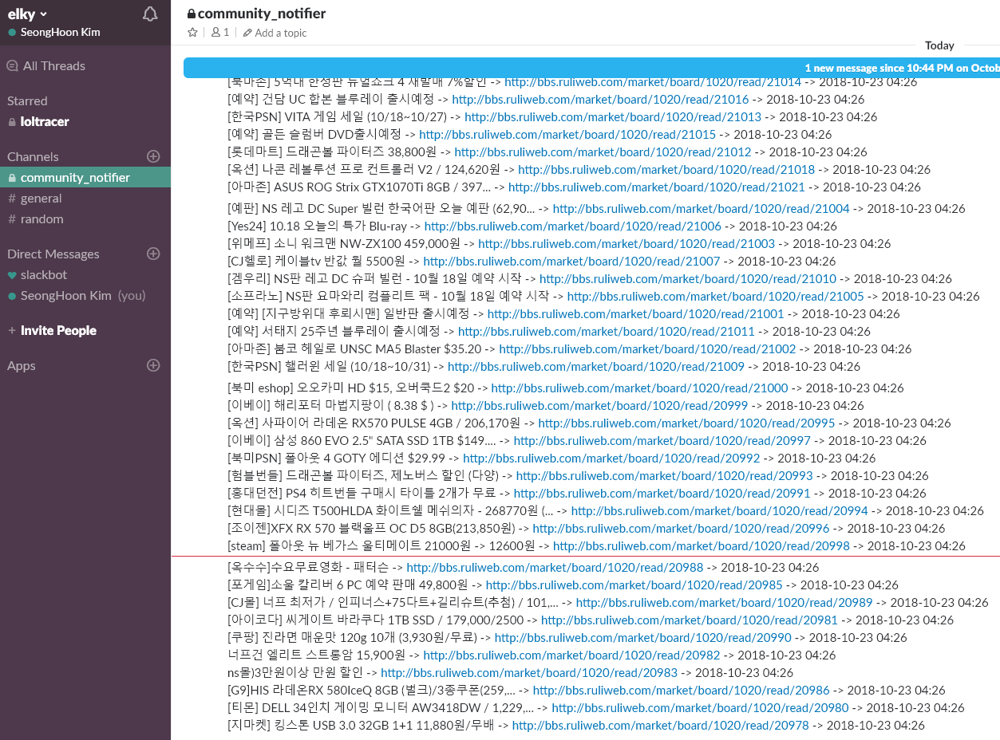

[](https://elky84.github.io)


# Community Notifier Desktop
MongoDB를 읽고, 크롤링된 정보를 notification 해주는 서비스입니다.

```
$ npm install
$ node app.js
```

10초에 하나씩 꺼내서 커맨드로 실행해줍니다.


이 프로젝트는 <https://github.com/elky84/community_notifier> 프로젝트에서 크롤링한 정보를 바탕으로 동작합니다.

local에 설치된 mongodb를 바탕으로 동작하므로, 해당 설정 정보를 수정하셔야 합니다.


# Community Notifier Daemon
MongoDB를 읽고, 크롤링된 정보를 notification 해주는 서비스입니다.

```
$ npm install
$ node app.js
```

1초마다, 통지 안된 새 글을 slack으로 notify 합니다.



이 프로젝트는 <https://github.com/elky84/community-notifier-py> 프로젝트에서 크롤링한 정보를 바탕으로 동작합니다.

local에 설치된 mongodb를 바탕으로 동작하므로, 해당 설정 정보를 수정하셔야 합니다.

config.json에는 slack incoming hook url을 입력해주시면됩니다.

config.json.sample 파일을 참고해주시어서, config.json 파일을 생성 후 동작시켜주시면 됩니다.
